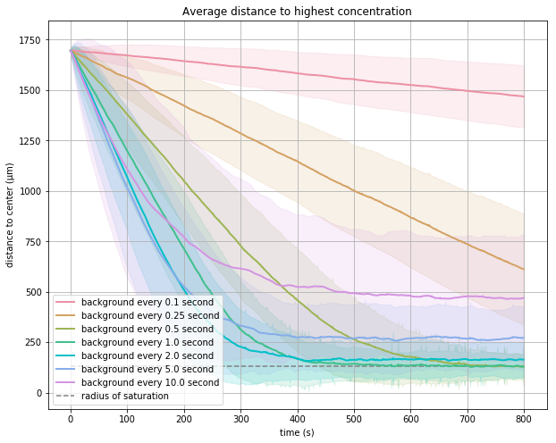

## Background tumbling frequency

We've showed on a molecular level, how the chemotaxis pathway in *E. coli* adjusts the tumbling frequency in response to ligand concentration changes and thus guiding the cell to move up the gradient. The question we left unanswered is: why there is a background tumbling frequency of one tumble every second?

To address this question, we will use what we've learned about chemotaxis and our BNG model results to build a random walk simulation. The model will be much more advanced than the one in the prologue because it will change the particle's response to the current amount of attractant present based our knowledge on bacterium's response to its environment.

In this simulation, each particle will represent one bacterium. They will be allowed to walk in a 2D space with a ligand concentration gradient. The distance unit will be 1µm (ex. moving from [0, 0] to [0, 20] is 20µm, which takes 1 second for the speed of *E. coli*). All cells will start at [0, 0], where has a ligand concentration 100 molecules/µm3. The highest concentration  of 1e8.5 molecules/µm3 is located at [1200, 1200], far away from the origin. There is an exponential gradient centered at the target in the space (the exponent is linearly dependent on the distance to [1200, 1200]).

**STOP:** How can we determine quantitatively how well a randomly walking bacterium has done at finding the attractant?
{: .notice--primary}

Answer: run the simulation many times for many simulated particles, and then examine the average distance from the “food source”. Also keep in mind that if two mechanisms can get to the "food source" equally well, we will definitely want to get there faster. 

We will tweak the default tumbling frequency (represented as expected duration of run before each tumble, `time_exp`) for each simulation and see if some tumbling frequencies are better than others for bacteria to find the food.

[Visit random walk tutorial](tutorial_walk){: .btn .btn--primary .btn--large}
{: style="font-size: 100%; text-align: center;"}

With the visualization of trajectories, we can see that the cells all move away from the starting points towards the target. However, how well they get to the target is different for different expected run time. For example, after 500 seconds, the cells with `time_exp = 0.1` and `time_exp = 0.25` are still very far from the target; while the those with `time_exp = 10` reached the target but don't stay there.

{: .align-center}
<figcaption>Sample trajectories for each tumbling frequency. The background color indicates concentration: white -> red = low -> high; black dot are starting points; red dots are the points they reached at the end of the simulation; colorful small dots represents trajectories (one color one cell): dark -> bright color = older -> newer time points; dark dashed circle is where concentration reaches 1e8.</figcaption>

What will a good trajectory look like? It should move fast towards the target; after reaching the target, it should tumble immediately when moving to somewhere with lower concentration and thus stay there. If we plot average distance to the target through time, a good `time_exp` should be characterized by a fast decrease in distance to the target, followed by flattening as close to the target as possible.

{: .align-center}
<figcaption>Average distances through time. Each colored line indicates a `time_exp`, plotting average distances for the 500 cells; the shaded area is standard deviation; grey dashed line is where concentration reaches 1e8.</figcaption>

There is a tradeoff between moving towards the target fast and staying there. For large `time_exp` values (10.0, 5.0, 2.0), distances to center decreases very quickly at the beginning of the simulation, but the cells don't stay perfectly around the radius of saturation; the larger the `time_exp`, the further the distance becomes. For small `time_exp` values (0.1, 0.25, 0.5), the cells failed to move to the ligand efficiently. Note that for `time_exp = 0.5` and `time_exp = 1.0`, although both stay around the radius of saturation, `time_exp = 0.5` takes about 200s more. If you tried to allow 0.1 and 0.25 to flatten, they will take even longer.

Now we can answer the question of why 1 tumble per second. The goal of chemotaxis is to find the high concentration region and stay there; and the faster the cell can achieve this goal the better. If cells tumble too much, the goal can be achieved, but not efficiently; if tumble too little, they run by the attractant because they aren't stopping to sniff for food often enough.

Recall the video of *E. coli* moving towards to the sugar crystal.
<iframe width="640" height="360" src="https://www.youtube.com/embed/F6QMU3KD7zw" frameborder="0" allowfullscreen></iframe> 

Our simulated *E. coli* do behave like those in the video. They generally move towards the crystal and stay close to it. Some run by the crystal, but then turn around to move toward the it.

## Smarter than we thought

However, like most things in biology, the reality turns out to be even more complex than we might imagine. 

One aspect of chemotaxis that is more advanced than we thought is the degree of reorientation. Consider - if a bacterium tumbles while moving up the gradient vs. moving down the gradient, how would the adjustment of degree of reorientation enable the cell to find food better?

The cell should turn a smaller angle if moving up a gradient - because moving to a very different direction might cause it to lose the gradient. And it should turn a larger angle if moving up the gradient, because turning around could be a good idea. This directional persistence when traveling up the gradient is observed in experiments[^Saragosti2011].

With more experimental evidences, the model of *E. coli* chemotaxis has been constantly improved. That means the cellular systems powering bacteria like *E. coli* are even smarter than originally thought!

## Excercise

1. 

[^Saragosti2011]: Saragosti J, Calvez V, Bournaveas, N, Perthame B, Buguin A, Silberzan P. 2011. Directional persistence of chemotactic bacteria in a traveling concentration wave. PNAS. [Available online](https://www.pnas.org/content/pnas/108/39/16235.full.pdf)

[Next chapter](../coronavirus/home){: .btn .btn--primary .btn--large}
{: style="font-size: 100%; text-align: center;"}
